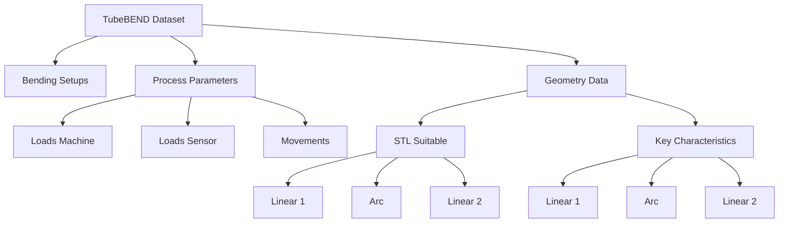

# Rotary Tube Bending Process Dataset

**Authors:** Zeyneddin Oez, Jonas Knoche, Alireza Yazdani, Bernd Engel, Kristof Van Laerhoven

**Affiliation:** [**University of Siegen**](https://www.uni-siegen.de/start/), Germany

This repository contains a real-world dataset from 318 tube bending processes (including 3 failed cases: IDs 1, 48, and 166). The dataset is stored in a serialized Python pickle file named `experiments_process_and_results.pkl`. It is designed as a benchmark for validating and comparing the performance of machine learning and signal analysis methods. The dataset includes: <br><be>

<p align="center">
  
  
  <em><br>
  Figure 1: The left shows the cross-section of the tube bending machine and its tools (1-Bend Die, 2.1-Inner Clamp Die, 2.2-Outer Clamp Die, 3-Pressure Die, 4-Mandrel, 5-Wiper Die, 6-Collet) <strong>(adapted from [1])</strong>.  
  The right shows the bending process.
  </em>
</p>


**A- Bending Setups**:
  * **Tube:** Outer Diameter, Wall Thickness
  * **Machine:** Bending Target Angle, Wiper Die Shortening, Pressure Die Lateral Position, Pressure Die Distance, Pressure Die Boost, Mandrel Position, Mandrel Retraction Timing, Collet Boost, and Clamp Die Lateral Position. <br><be>


**B- Process Parameters**:
  * **Loads:** 
    * **Machine:** Bend Die Lateral, Bend Die Rotating, Bend Die Vertical, Clamp Die Lateral, Collet Axial, Collet Rotating, Mandrel Axial, Pressure Die Axial, Pressure Die Lateral, and Pressure Die Left Axial.  
    * **Sensor:** Mandrel Axial, Pressure Die Lateral 1, and Pressure Die Lateral 2.
  * **Movements:** Bend Die Lateral, Bend Die Rotating, Bend Die Vertical, Clamp Die Lateral, Collet Axial, Collet Rotating, Mandrel Axial, Pressure Die Axial, Pressure Die Lateral, and Pressure Die Left Axial. <br><be>

**C- Geometry Data**:
  * **STL Suitable:**
    * **Linear 1:** 50 series of datasets from one endpoint of the arc
    * **Arc:** Datasets ranging from 0 to the bending target angle, going up every 1 degree
    * **Linear 2:** 25 series of datasets from another endpoint of the arc
  * **Key Characteristics:**
    * **Linear 1:** Secondary Axis, Main Axis, Out of Roundness
    * **Arc:** Secondary Axis, Main Axis, Out of Roundness
    * **Linear 2:** Secondary Axis, Main Axis, Out of Roundness <br><be>


<p align="center">
  
  
  <em>  <br><be> Figure 2: The left shows the force and movement directions in the machine. The right shows geometry aspects. </em>
</p>


The file is tracked using [Git Large File Storage (Git LFS)](https://git-lfs.com/) due to its larger size (~800 MB).


To load, explore, and visualize data from this dataset, the following steps can be followed using Python (version 3.10 or higher). First, install the required packages:

```python
pip install -r requirements.txt
```

---



### Part 1: Import Required Library and Load the Dataset

```python
import pickle

with open('experiments_process_and_results.pkl', 'rb') as f:
    loaded_dict = pickle.load(f)
 ```

---
### Part 2: Showing All Bending Setups

```python
# To see all bending setups in one table
from utils import take_all_bending_setups

all_bending_setups = take_all_bending_setups(loaded_dict)
all_bending_setups:
 ```

<div style="max-height:130px; overflow:auto;">

|   | Experiment | Tube | Outer-diameter | Wall-thickness | Target-angle | Wiper-die shortening | Pressure-die lateral position | Pressure-die distance | Pressure-die boost | Mandrel position | Mandrel retraction timing | Collet boost | Clamp-die lateral position | Comments |
|--:|-----------:|-----:|---------------:|---------------:|-------------:|---------------------:|------------------------------:|----------------------:|-------------------:|-----------------:|--------------------------:|-------------:|---------------------------:|----------|
| 0 | 1          | 107  | 22              | 1               | 47           | 5                     | -50.45                        | 0.3                   | 0                  | -2909.8          | 2                         | 0.85         | 225.25                    | Connection to machine failed |
| 1 | 2          | 106  | 22              | 1               | 47           | 5                     | -50.45                        | 0.3                   | 0                  | -2909.8          | 2                         | 0.85         | 225.25                    |          |
| 2 | 3          | 105  | 22              | 1               | 47           | 5                     | -50.45                        | 0.3                   | 0                  | -2909.8          | 2                         | 0.85         | 225.25                    |          |
| ... | ...      | ...  | ...             | ...             | ...          | ...                   | ...                           | ...                   | ...                | ...              | ...                       | ...          | ...                       | ...      |
| 315 | 316      | 217  | 22              | 1               | 47           | 5                     | -50.45                        | 0.6                   | 0.9                | -2905.6          | 2                         | 0.9          | 225.4                     |          |
| 316 | 317      | 216  | 22              | 1               | 47           | 5                     | -50.45                        | 0.6                   | 0.9                | -2907.6          | 2                         | 0.9          | 225.4                     |          |
| 317 | 318      | 215  | 22              | 1               | 47           | 5                     | -50.45                        | 0.6                   | 0.9                | -2907.6          | 2                         | 0.9          | 225.4                     |          |


---

### Part 3: Choosing A Specific Experiment
#### 3.1 Load all data from an experiment as a dictionary

```python
# Experiment numbers range from 1 to 318. For example, we select the 11th one:
experiment_number = 11

experiment_as_dictinary = loaded_dict[f'Exp_{experiment_number}']
 ```
#### 3.2- Loading a specific section from the selected experiment's dataframe:
We gave each section a name according to the dataset definition at the beginning of this document, which can later be used to load that specific part of the data.
These names are:

*  bending_setups

*  process_parameters_loads_machine
*  process_parameters_loads_sensor
*  process_parameters_movements

*  geometry_data_stl_suitable_linear_1
*  geometry_data_stl_suitable_arc
*  geometry_data_stl_suitable_linear_2

*  geometry_data_key_characteristics_linear_1
*  geometry_data_key_characteristics_arc
*  geometry_data_key_characteristics_linear_2


```python
# Loading the desired section from the dataframe
features_as_pandas_dataframe = experiment_as_dictinary['process_parameters_loads_sensor']
```
features_as_pandas_dataframe.head():

|    |   Time_[s] |   SENSOR_MANDREL_AXIAL_Load_[kN] |   SENSOR_PRESSURE-DIE_LATERAL_1_Load_[kN] |   SENSOR_PRESSURE-DIE_LATERAL_2_Load_[kN] |
|---:|-----------:|---------------------------------:|------------------------------------------:|------------------------------------------:|
|  0 |       0    |                        0.103435  |                                 0.028831  |                              -0.000158929 |
|  1 |       0.01 |                        0.0984101 |                                 0.0281868 |                               0.00112951  |
|  2 |       0.02 |                        0.100085  |                                 0.0384943 |                               0.00177373  |
| ... |       ... |                              ... |                                       ... |                                       ... |


---
### 4- Plotting Experiment

#### 4.1- Plotting all features from a specific data:
```python
from utils import multi_sensor_subplots

multi_sensor_subplots(features_as_pandas_dataframe, save_fig=True, output_path=f"Exp_{experiment_number}_all_sensors")
```
[Click here for interactive plot result (Firefox only)](https://zeyneddinoz.github.io/tubebend/plots/Exp_11_all_sensors)


#### 4.2- Plotting one feature from specific data:
```python
sensor_name = 'SENSOR_MANDREL_AXIAL_Load_[kN]'

multi_sensor_subplots(features_as_pandas_dataframe[['Time_[s]', sensor_name]], save_fig=True, output_path=f"Exp_{experiment_number}_{sensor_name}_sensors")

# Other options can be seen in this list:
print(list(features_as_pandas_dataframe.columns)[1:])
```

[Click here for interactive plot result (Firefox only)](https://zeyneddinoz.github.io/tubebend/plots/Exp_11_SENSOR_MANDREL_AXIAL_Load_[kN]_sensors)

---

This work was funded by the Deutsche Forschungsgemeinschaft (DFG, German Research Foundation) – Project-IDs 520256321.

📄 The dataset is shared for preview/research purposes. The license will be added later.

## References
[1] Borchmann, L., Schneider, D., and Engel, B. "*Design of a fuzzy controller to prevent wrinkling during rotary draw bending*" (2021).

## To cite this dataset:
```python
@article{oz2025tubebend,
  title={TubeBEND: A Real-World Dataset for Geometry Prediction in Rotary Draw Bending},
  author={Oz, Zeyneddin and Knoche, Jonas and Yazdani, Alireza and Engel, Bernd and Van Laerhoven, Kristof},
  journal={arXiv preprint arXiv:2509.10272},
  year={2025}
}
```
