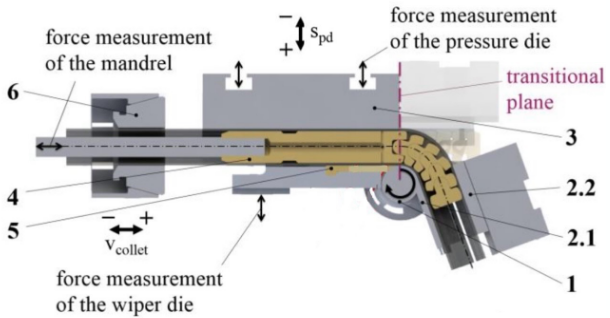
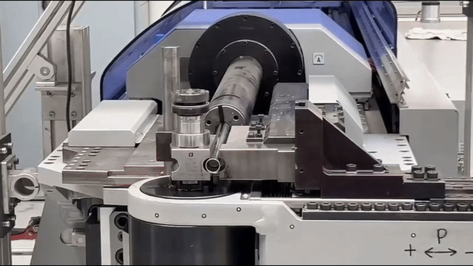
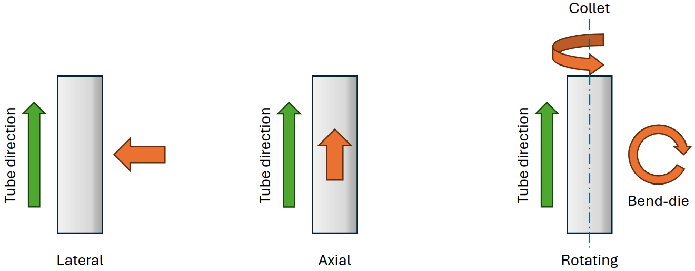
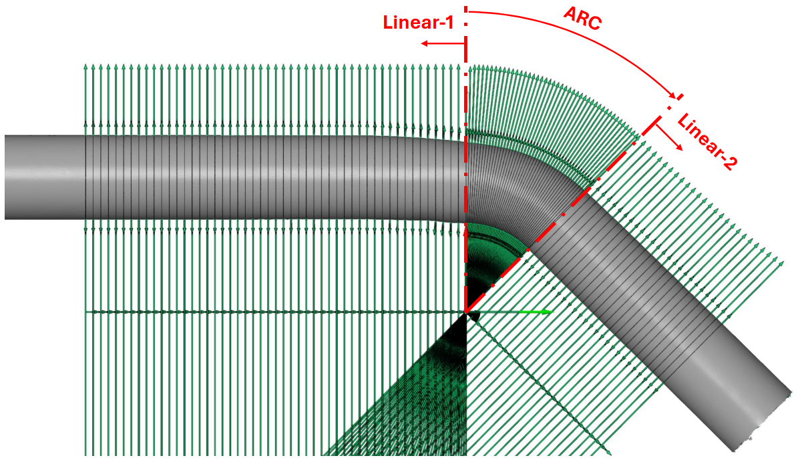

# Rotary Tube Bending Process Dataset

Authors: Zeyneddin Oz, Jonas Knoche, Alireza Yazdani, Bernd Engel, Kristof Van Laerhoven


This repository contains a real-world dataset from 318 tube bending processes (including 3 failed cases: IDs 1, 48, and 166). The dataset is stored in a serialized Python pickle file named `experiments_process_and_results.pkl`. It is designed as a benchmark for validating and comparing the performance of machine learning and signal analysis methods. The dataset includes: <br><be>

<p align="center">
  
  
  <em>  <br><be> Figure 1: The left shows the cross-section of the tube bending machine and its tools (1-Bend Die, 2.1-Inner Clamp Die, 2.2-Outer Clamp Die, 3-Pressure Die, 4-Mandrel, 5-Wiper Die, 6-Collet). The right shows the bending process. </em>
</p>


**A- Bending Setups**:
  * **Tube:** Outer Diameter, Wall Thickness
  * **Machine:** Bending Target Angle, Wiper Die Shortening, Pressure Die Lateral Position, Pressure Die Distance, Pressure Die Boost, Mandrel Position, Mandrel Retraction Timing, Collet Boost, and Clamp Die Lateral Position. <br><be>


**B- Process Parameters**:
  * **Loads:** 
    * **Machine:** Bend Die Lateral, Bend Die Rotating, Bend Die Vertical, Clamp Die Lateral, Collet Axial, Collet Rotating, Mandrel Axial, Pressure Die Axial, Pressure Die Lateral, and Pressure Die Left Axial.  
    * **Sensor:** Mandrel Axial, Pressure Die Lateral 1, and Pressure Die Lateral 2.
  * **Movements:** Bend Die Lateral, Bend Die Rotating, Bend Die Vertical, Clamp Die Lateral, Collet Axial, Collet Rotating, Mandrel Axial, Pressure Die Axial, Pressure Die Lateral, and Pressure Die Left Axial. <br><be>

**C- Geometry Data**:
  * **STL Suitable:**
    * **Linear 1:** 50 series of datasets from one endpoint of the arc
    * **Arc:** Datasets ranging from 0 to the bending target angle, going up every 1 degree
    * **Linear 2:** 25 series of datasets from another endpoint of the arc
  * **Key Characteristics:**
    * **Linear 1:** Secondary Axis, Main Axis, Out of Roundness
    * **Arc:** Secondary Axis, Main Axis, Out of Roundness
    * **Linear 2:** Secondary Axis, Main Axis, Out of Roundness <br><be>


<p align="center">
  
  
  <em>  <br><be> Figure 2: The left shows the force and movement directions in the machine. The right shows geometry aspects. </em>
</p>


The file is tracked using [Git Large File Storage (Git LFS)](https://git-lfs.com/) due to its larger size (~660 MB).


To load, explore, and visualize data from this dataset, the following steps can be followed using Python. First, install the required packages:
```python
pip install -r requirements.txt
```

---

### Part 1: Import Required Library and Load the Dataset

```python
import pickle

with open('experiments_process_and_results.pkl', 'rb') as f:
    loaded_dict = pickle.load(f)
 ```

---
### Part 2: Showing All Bending Setups

```python
# To see all bending setups in one table
from utils import take_all_bending_setups

all_bending_setups = take_all_bending_setups(experiments_process_and_results)
all_bending_setups:
 ```

<div style="max-height:130px; overflow:auto;">

<table>
  <thead>
    <tr>
      <th>Experiment</th>
      <th>Tube</th>
      <th>Outer-diameter</th>
      <th>Wall-thickness</th>
      <th>Target-angle</th>
      <th>Wiper-die shortening</th>
      <th>Pressure-die lateral position</th>
      <th>Pressure-die distance</th>
      <th>Pressure-die boost</th>
      <th>Mandrel position</th>
      <th>Mandrel retraction timing</th>
      <th>Collet boost</th>
      <th>Clamp-die lateral position</th>
      <th>Comments</th>
    </tr>
  </thead>
  <tbody>
    <tr><td>0</td><td>1</td><td>107.0</td><td>22.0</td><td>1.0</td><td>47.0</td><td>5.0</td><td>-50.45</td><td>0.3</td><td>0.0</td><td>-2909.8</td><td>2.0</td><td>0.85</td><td>Connection to machine failed</td></tr>
    <tr><td>1</td><td>2</td><td>106.0</td><td>22.0</td><td>1.0</td><td>47.0</td><td>5.0</td><td>-50.45</td><td>0.3</td><td>0.0</td><td>-2909.8</td><td>2.0</td><td>0.85</td><td>NaN</td></tr>
    <tr><td>2</td><td>3</td><td>105.0</td><td>22.0</td><td>1.0</td><td>47.0</td><td>5.0</td><td>-50.45</td><td>0.3</td><td>0.0</td><td>-2909.8</td><td>2.0</td><td>0.85</td><td>NaN</td></tr>
    <tr><td>...</td><td>...</td><td>...</td><td>...</td><td>...</td><td>...</td><td>...</td><td>...</td><td>...</td><td>...</td><td>...</td><td>...</td><td>...</td><td>...</td></tr>
    <tr><td>315</td><td>316</td><td>217.0</td><td>22.0</td><td>1.0</td><td>47.0</td><td>5.0</td><td>-50.45</td><td>0.6</td><td>0.9</td><td>-2905.6</td><td>2.0</td><td>0.90</td><td>NaN</td></tr>
    <tr><td>316</td><td>317</td><td>216.0</td><td>22.0</td><td>1.0</td><td>47.0</td><td>5.0</td><td>-50.45</td><td>0.6</td><td>0.9</td><td>-2907.6</td><td>2.0</td><td>0.90</td><td>NaN</td></tr>
    <tr><td>317</td><td>318</td><td>215.0</td><td>22.0</td><td>1.0</td><td>47.0</td><td>5.0</td><td>-50.45</td><td>0.6</td><td>0.9</td><td>-2907.6</td><td>2.0</td><td>0.90</td><td>NaN</td></tr>
  </tbody>
</table>

</div>

---

### Part 3: Choosing A Specific Experiment
#### 3.1 Load all data from an experiment as a dictionary

```python
# Experiment numbers range from 1 to 318. For example, we select the 11th one:
experiment_number = 11

experiment_as_dictinary = loaded_dict[f'Exp_{experiment_number}']
 ```
#### 3.2- Loading a specific section from the selected experiment's dataframe:
We gave each section a name according to the dataset definition at the beginning of this document, which can later be used to load that specific part of the data.
These names are:

*  bending_setups

*  process_parameters_loads_machine
*  process_parameters_loads_sensor
*  process_parameters_movements

*  geometry_data_stl_suitable_linear_1
*  geometry_data_stl_suitable_arc
*  geometry_data_stl_suitable_linear_2

*  geometry_data_key_characteristics_linear_1
*  geometry_data_key_characteristics_arc
*  geometry_data_key_characteristics_linear_2


```python
# Loading the desired section from the dataframe
features_as_pandas_dataframe = experiment_as_dictinary['process_parameters_loads_sensor']
```
features_as_pandas_dataframe.head():

|    |   Time_[s] |   SENSOR_MANDREL_AXIAL_Load_[kN] |   SENSOR_PRESSURE-DIE_LATERAL_1_Load_[kN] |   SENSOR_PRESSURE-DIE_LATERAL_2_Load_[kN] |
|---:|-----------:|---------------------------------:|------------------------------------------:|------------------------------------------:|
|  0 |       0    |                        0.103435  |                                 0.028831  |                              -0.000158929 |
|  1 |       0.01 |                        0.0984101 |                                 0.0281868 |                               0.00112951  |
|  2 |       0.02 |                        0.100085  |                                 0.0384943 |                               0.00177373  |
|  3 |       0.03 |                        0.0984101 |                                 0.0281868 |                              -0.000158929 |
|  4 |       0.04 |                        0.10511   |                                 0.0391385 |                               0.000485291 |


---
### 4- Plotting Experiment

#### 4.1- Plotting all features from a specific data:
```python
from utils import multi_sensor_subplots

multi_sensor_subplots(features_as_pandas_dataframe, save_fig=True, output_path=f"Exp_{experiment_number}_all_sensors")
```
[Click here for interactive plot result (Firefox only)](https://zeyneddinoz.github.io/tubebend/plots/Exp_11_all_sensors)


#### 4.2- Plotting one feature from specific data:
```python
sensor_name = 'SENSOR_MANDREL_AXIAL_Load_[kN]'

multi_sensor_subplots(features_as_pandas_dataframe[['Time_[s]', sensor_name]], save_fig=True, output_path=f"Exp_{experiment_number}_{sensor_name}_sensors")

# Other options can be seen in this list:
print(list(features_as_pandas_dataframe.columns)[1:])
```

[Click here for interactive plot result (Firefox only)](https://zeyneddinoz.github.io/tubebend/plots/Exp_11_SENSOR_MANDREL_AXIAL_Load_[kN]_sensors)

---

📄 This dataset is shared for preview/research purposes. The license will be added later.
